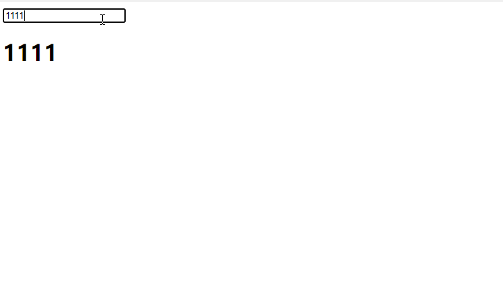

今天摸鱼时间，突然想实现一个双向绑定。先上一个效果图:



复盘一下思路.

# 目的

双向绑定, 即实现 `view 层 --> model 层` 和 `model层 --> view层` 的 **"同步"** , 对应到前端即 `DOM` 和 `Plain JavaScript Object` .


# 问题分解

通过对目的的分析, 可以将解决问题的步骤分为两步.

## DOM --> POJO

借助 DOM Listeners, 可以很简单的实现 DOM 到 POJO的绑定.

即 当发生某种事件(输入), 将值赋给 POJO.

```javascript
$('#input').on('input', (e) => {
	value = e.target.value;
})
```


## POJO --> DOM

要想实现这一步, 就需要监听到 `js` 对象的数据改变.

众所周知,  js 简单数据类型(`primitive values`) 值本身无法被改变. 每次都是在栈中生成一个新的值. **这种情况下, 无法实现监听. 因为值没有改变, 只是产生了新的值**

与之不同的是 Object(`Reference Value` ), 存储在内存的堆上, 每次赋值都是简单的将一个新的变量, 指向Object的内存地址.

基于以上知识, 我们将需要被监听的值, 挂载到一个对象上. 然后借助 Object 提供的内置方法实现对值的监听.


## JavaScript 对象的两类属性

JavaScript 使用特征(attribute)来描述属性(property).

### 数据属性

- value: 属性值
- writable: 决定属性能否被赋值
- enumerable: 决定 for in 能否枚举该属性
- configurable: 决定该属性能否被删除或者改变特征值

### 访问器属性(getter / setter)

- getter: 函数或者undefined, 在取值时被调用.
- setter: 函数或者undefined, 在设值时被调用.
- enumerable: 决定 for in 能否枚举该属性.
- configurable: 决定该属性能否被删除或者改变特征值.


这里我们通过改写对象的访问器属性来监听 `js` 对象的数据改变. 代码如下:

```javascript
const vm = {
}

let value = '';

Object.defineProperty(vm, 'value', {
	set: function(val) {
        value = val;
		console.log(`defineProperty set ${val}`);
	},
	get: function() {
		return `defineProperty get ${value}`;
	}
})

vm.value = 'xxx'; // defineProperty set xxx
vm.value; // defineProperty get xxx
```

顾名思义, 通过 `Object.defineProperty()` 设置了对象的 `value` 属性, 并对其 `get` 和 `set` 进行重写操作. 借助 `defineProperty`  可以实现在对象改变时, 执行某些操作(可能是更新 DOM, 也可能是触发某些事件). 这也解释了为什么在 `vue` 中, 使用 `this.xxx = xxx` 的写法.


## 完整实现

再回到目的, 我们期待 POJO 的变化能够 **同步** 到DOM层, 那么我们就可以如此实现:

```javascript
const vm = {
}

// 找到所有具有 data-value 属性的DOM
const valueDom = $('*[data-value]');

Object.defineProperty(vm, 'value', {
	set: function(val) {
        // 将变动更新到DOM层
       	valueDom.each(function(){
			$(this).val(val)
			$(this).text(val)
		})
	}
})
```

再结合 DOM --> POJO 的实现, 可以得出完整的实现:

```html
<!DOCTYPE html>
<html>
<head>
	<script
  src="https://code.jquery.com/jquery-3.5.1.slim.min.js"
  integrity="sha256-4+XzXVhsDmqanXGHaHvgh1gMQKX40OUvDEBTu8JcmNs="
  crossorigin="anonymous"></script>
	<meta charset="utf-8">
	<title>双向绑定</title>
</head>
<body>
	<div id="app">
		<input data-value id="input">
		<h1 id="text" data-value></h1>
	</div>
</body>
<script type="text/javascript" charset="utf-8">
	const vm = {
	}
	const valueDom = $('*[data-value]');
	Object.defineProperty(vm, 'value', {
		set: function(val) {
			valueDom.each(function(){
				$(this).val(val)
				$(this).text(val)
			})
		}
	})
	$('#input').on('input', (e) => {
		let { value } = e.target;
		if(value.length > 10) {
            // model --> view
			value = '已超出限制'
		}
		vm.value = value;
	})

</script>
</html>
```


## Proxy

通过上面代码我们可以发现:

1. `defineProperty` 监听的是对象属性, 而非对象. 所以在使用时, 我们需要遍历所有的对象属性, 而当属性值也是一个对象时, 可能需要嵌套监听.
2. `defineProperty` 无法监控到数组下标的变化，导致直接通过数组下标设置值，不能实时响应。


### defineProperty 监听数组


`Object.defineProperty` 方法用于给对象添加对象, 无法直接给数组添加或删除元素, 所以我们通过给对象添加一个数组类型的属性,再劫持.

```javascript
const vm = {};

let arr = null;

Object.defineProperty(vm, 'arr', {
  set: (newValue) => {
    arr = newValue;
    console.log('defineProperty===检测改变', newValue);
  },
  get: () => {
    console.log('defineProperty===获取arr')
    return arr;
  }
})
vm.arr = [];	// defineProperty===检测改变 []
vm.arr[1] = 12; // defineProperty===获取arr
console.log(vm.arr); // [empty, 12]
```

> Array 是一种特殊的Object, 如果直接对 Array 的指定位置进行监听也可以监听到.


```javascript
const vm = [];


Object.defineProperty(vm, 1, {
  set: (newValue) => {
    console.log('defineProperty===检测改变', newValue);
  },
  get: () => {
    console.log('defineProperty===获取')
  }
})

vm[1] = 12;		// defineProperty===检测改变 12
console.log(vm); // [empty, 12]
// defineProperty===获取arr
```

但是很明显我们无法使用这种方法, 监听数组的每一个位置.

### Proxy  监听数组

`Proxy` 对象用于定义基本操作的自定义行为, 可以理解为在目标对象架设一层 "拦截", 通过这种拦截机制可以对外界的访问进行过滤和改写.

```javascript
const vm = [];

// 通过Proxy代理
const proxyVM = new Proxy(vm, {
  set: (target, propKey, newValue, receiver) => {
    console.log('proxy===检测改变', newValue);
    return Reflect.set(target, propKey, newValue, receiver)
  },
  get: (target, propKey, receiver) => {
    console.log('proxy===获取');
    return Reflect.get(target, propKey, receiver)
  }
})

proxyVM[1] = 12;	// proxy===检测改变 12
vm[1] = 11;		//
proxyVM[1]; // proxy===获取 11
console.log(proxyVM);	// [empty, 11]
```

Proxy可以监听整个对象, 而且可以感知到通过数组下标赋值的改变.

**可以发现, 只有 Proxy()对象才可以触发set事件, 如果直接对原目标操作是无法触发事件** .

### Proxy实现双向绑定

```javascript
<!DOCTYPE html>
<html>
<head>
	<script
  src="https://code.jquery.com/jquery-3.5.1.slim.min.js"
  integrity="sha256-4+XzXVhsDmqanXGHaHvgh1gMQKX40OUvDEBTu8JcmNs="
  crossorigin="anonymous"></script>
	<meta charset="utf-8">
	<title>双向绑定</title>
</head>
<body>
	<div id="app">
		<input data-value id="input">
		<h1 id="text" data-value></h1>
	</div>
</body>
<script type="text/javascript" charset="utf-8">
	const vm = {
	}
	const valueDom = $('*[data-value]');
	// proxy 写法
	const proxyVM = new Proxy(vm, {
		get: (target, propKey, receiver) => {
			console.log(`proxy get ${propKey}!`);
			return Reflect.get(target, propKey, receiver);
		},
		set: (target, propKey, value, receiver) => {
			if(propKey === 'value') {
				valueDom.each(function(){
					$(this).val(value)
					$(this).text(value)
				})
			}
			return Reflect.set(target, propKey, value, receiver);
		}
	})
	$('#input').on('input', (e) => {
		let { value } = e.target;
		if(value.length > 10) {
			value = '已超出限制'
		}
		proxyVM.value = value;
	})
</script>
</html>
```
# 结束

通过一个最简单的双向绑定, 复习了 **对象的两类属性** , 其中访问器属性可以帮助我们实现对对象值的劫持.

通过 `defineProperty` 劫持对象, 实现最简单的双向绑定.

为了解决 `defineProperty` 带来的弊端, 使用 `Proxy` 实现了同等效果的双向绑定.

横向对比学习了 `defineProxy` 和 `Proxy` 的区别和共同点.
