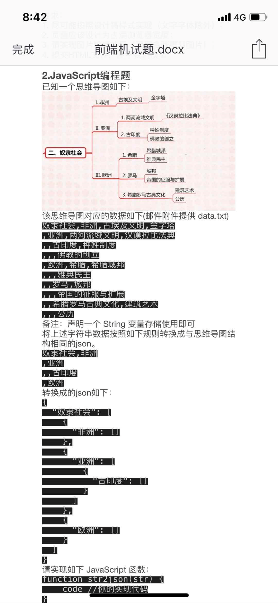

# 题目



```javascript
const str = "奴隶社会,非洲,古埃及文明,金字塔\n,亚洲,两河流域文明,汉谟拉比法典\n,,古印度,种姓制度\n,,,佛教的创立\n,欧洲,希腊,希腊城邦\n,,,雅典民主\n,,罗马,城邦\n,,,帝国的征服与扩展\n,,希腊罗马古典文化,建筑艺术\n,,,公历";
```
# 解法

1. 首先看到本题，产生的第一个疑文是，这个逗号看起来有些思路，但是具体呢没有发现规律。

2. 这种树状结构还比较常见，但是这个字符串形式让人很困惑

3. 第一步，肯定是找规律，会发现，开头的逗号和层级刚好形成对应关系，故考虑用表格整理思路：

   | 层级0    | 层级1 | 层级2            | 层级3            |
   | -------- | ----- | ---------------- | ---------------- |
   | 奴隶社会 | 非洲  | 古埃及文明       | 金字塔           |
   | NULL     | 亚洲  | 两河流域文明     | 汉谟拉比法典     |
   | NULL     | NULL  | 古印度           | 种姓制度         |
   | NULL     | NULL  | NULL             | 佛教的创立       |
   | NULL     | 欧洲  | 希腊             | 希腊城邦         |
   | NULL     | NULL  | NULL             | 雅典民主         |
   | NULL     | NULL  | 罗马             | 城邦             |
   | NULL     | NULL  | NULL             | 帝国的征服与扩展 |
   | NULL     | NULL  | 希腊罗马古典文化 | 建筑艺术         |
   | NULL     | NULL  | NULL             | 公历             |
 4. 我们发现 `,` 的个数，刚好表示每一行所对应的层级。同时，这其实是一个 **深度优先搜索算法(DFS)** 得到的结果.
 5. 第二步, 用 `split` 得到一个二维数组.
 6. 第三步, 观察结果结构. 其实是一个 *以字符串为Attribute, 以数组为Value的对象* .
 7. 第四步, 构建结果. 首先要找到根节点 "奴隶社会", 然后依次往下递进, 同行的每一列值, 都是前一列的子代.
 8. 第五步, 处理为空的列. 当出现为空列时, 不用急着处理它, 可以依次找到不为空的那列. 此使的列号,对应于结果的层数.(奴隶社会在第0层, 亚洲在第1层, 古印度在第2层)
 9. 第六步, 假设有一个函数能够根据 `树结构, 第几层` 来找到对应的 `层级数组`, 那么我们就可以直接将下一个节点插入改层级数组. 即可实现亚洲和非洲在统一层级.
 10. 最后按照以上思路实现如下:
   ```javascript
    function str2json(str) {
      const table = str.split('\n').map(row => row.split(','));
      const formatObj = [];
      let parentNode = null; // 当前的父节点
      for(let row = 0; row < table.length; row ++) {
        for(let col = 0; col < table[row].length; col ++) {
          if(row === 0 && col === 0) {
            formatObj[table[row][col]] = [];
          } else {
            if(table[row][col]) {
              // col 标志着当前节点属于第几层，根节点是第0层
              const node = {};
              node[table[row][col]] = [];
              parentNode = getLatestNode(formatObj, col)
              parentNode.push(node);
              parentNode = node[table[row][col]];
            }
          }
        }
      }
      console.log(formatObj);
      return formatObj;
    }

    function getLatestNode(obj, index) {
      let current = obj;
      let nextNode = obj;
      if(index === 0) {
        return obj;
      }
      for(let i = 0; i < index; i++) {
        const keyArr = Object.keys(nextNode);
        current = nextNode[keyArr[0]];
        nextNode = current[current.length - 1];
      }
      return current;
    }
   ```
